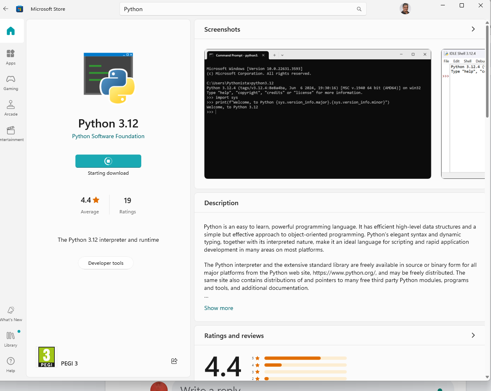

# DevAnsibleLAB


Creating a development environment with PostgreSQL in a Docker container and a Python application using PyQt connected to VSCode involves several steps. Below are detailed instructions and configurations for setting up your environment.

### Step 1: Create a Dockerfile for PostgreSQL

Create a `Dockerfile` for PostgreSQL to set up the PostgreSQL database in a Docker container.

<pre><div class="dark bg-gray-950 rounded-md border-[0.5px] border-token-border-medium"><div class="flex items-center relative text-token-text-secondary bg-token-main-surface-secondary px-4 py-2 text-xs font-sans justify-between rounded-t-md"><span>Dockerfile</span><div class="flex items-center"><span class="" data-state="closed"><button class="flex gap-1 items-center"><svg xmlns="http://www.w3.org/2000/svg" width="24" height="24" fill="none" viewBox="0 0 24 24" class="icon-sm"><path fill="currentColor" fill-rule="evenodd" d="M7 5a3 3 0 0 1 3-3h9a3 3 0 0 1 3 3v9a3 3 0 0 1-3 3h-2v2a3 3 0 0 1-3 3H5a3 3 0 0 1-3-3v-9a3 3 0 0 1 3-3h2zm2 2h5a3 3 0 0 1 3 3v5h2a1 1 0 0 0 1-1V5a1 1 0 0 0-1-1h-9a1 1 0 0 0-1 1zM5 9a1 1 0 0 0-1 1v9a1 1 0 0 0 1 1h9a1 1 0 0 0 1-1v-9a1 1 0 0 0-1-1z" clip-rule="evenodd"></path></svg>Copy code</button></span></div></div><div class="overflow-y-auto p-4" dir="ltr"><code class="!whitespace-pre hljs language-Dockerfile"># Use the official PostgreSQL image from the Docker Hub
FROM postgres:latest

# Set environment variables for PostgreSQL
ENV POSTGRES_USER myuser
ENV POSTGRES_PASSWORD mypassword
ENV POSTGRES_DB mydatabase

# Expose the PostgreSQL port
EXPOSE 5432

# Copy initialization script
COPY init.sql /docker-entrypoint-initdb.d/
</code></div></div></pre>

### Step 2: Create an Initialization Script

Create an `init.sql` file to initialize your PostgreSQL database. This file will be copied into the Docker container and executed when the container starts.

<pre><div class="dark bg-gray-950 rounded-md border-[0.5px] border-token-border-medium"><div class="flex items-center relative text-token-text-secondary bg-token-main-surface-secondary px-4 py-2 text-xs font-sans justify-between rounded-t-md"><span>sql</span><div class="flex items-center"><span class="" data-state="closed"><button class="flex gap-1 items-center"><svg xmlns="http://www.w3.org/2000/svg" width="24" height="24" fill="none" viewBox="0 0 24 24" class="icon-sm"><path fill="currentColor" fill-rule="evenodd" d="M7 5a3 3 0 0 1 3-3h9a3 3 0 0 1 3 3v9a3 3 0 0 1-3 3h-2v2a3 3 0 0 1-3 3H5a3 3 0 0 1-3-3v-9a3 3 0 0 1 3-3h2zm2 2h5a3 3 0 0 1 3 3v5h2a1 1 0 0 0 1-1V5a1 1 0 0 0-1-1h-9a1 1 0 0 0-1 1zM5 9a1 1 0 0 0-1 1v9a1 1 0 0 0 1 1h9a1 1 0 0 0 1-1v-9a1 1 0 0 0-1-1z" clip-rule="evenodd"></path></svg>Copy code</button></span></div></div><div class="overflow-y-auto p-4" dir="ltr"><code class="!whitespace-pre hljs language-sql">-- init.sql
CREATE TABLE IF NOT EXISTS users (
    id SERIAL PRIMARY KEY,
    username VARCHAR(50) NOT NULL,
    email VARCHAR(50) NOT NULL
);
</code></div></div></pre>

### Step 3: Docker Compose File

Create a `docker-compose.yml` file to simplify the process of running Docker containers.

<pre><div class="dark bg-gray-950 rounded-md border-[0.5px] border-token-border-medium"><div class="flex items-center relative text-token-text-secondary bg-token-main-surface-secondary px-4 py-2 text-xs font-sans justify-between rounded-t-md"><span>yaml</span><div class="flex items-center"><span class="" data-state="closed"><button class="flex gap-1 items-center"><svg xmlns="http://www.w3.org/2000/svg" width="24" height="24" fill="none" viewBox="0 0 24 24" class="icon-sm"><path fill="currentColor" fill-rule="evenodd" d="M7 5a3 3 0 0 1 3-3h9a3 3 0 0 1 3 3v9a3 3 0 0 1-3 3h-2v2a3 3 0 0 1-3 3H5a3 3 0 0 1-3-3v-9a3 3 0 0 1 3-3h2zm2 2h5a3 3 0 0 1 3 3v5h2a1 1 0 0 0 1-1V5a1 1 0 0 0-1-1h-9a1 1 0 0 0-1 1zM5 9a1 1 0 0 0-1 1v9a1 1 0 0 0 1 1h9a1 1 0 0 0 1-1v-9a1 1 0 0 0-1-1z" clip-rule="evenodd"></path></svg>Copy code</button></span></div></div><div class="overflow-y-auto p-4" dir="ltr"><code class="!whitespace-pre hljs language-yaml">version: '3.8'

services:
  postgres:
    build: .
    container_name: postgres_container
    ports:
      - "5432:5432"
    volumes:
      - postgres_data:/var/lib/postgresql/data
    environment:
      POSTGRES_USER: myuser
      POSTGRES_PASSWORD: mypassword
      POSTGRES_DB: mydatabase

volumes:
  postgres_data:
</code></div></div></pre>

### Step 4: Python Application with PyQt

Create a basic Python application using PyQt. You can install the required libraries using `pip`.

```
`pip install PyQt5`

`pip install pyqt5-tools  # Optional: This provides additional tools like Qt Designer `
```

#### Requirements File

Create a `requirements.txt` file for your Python dependencies.

<pre><div class="dark bg-gray-950 rounded-md border-[0.5px] border-token-border-medium"><div class="flex items-center relative text-token-text-secondary bg-token-main-surface-secondary px-4 py-2 text-xs font-sans justify-between rounded-t-md"><div class="flex items-center"><span class="" data-state="closed"><button class="flex gap-1 items-center"><svg xmlns="http://www.w3.org/2000/svg" width="24" height="24" fill="none" viewBox="0 0 24 24" class="icon-sm"><path fill="currentColor" fill-rule="evenodd" d="M7 5a3 3 0 0 1 3-3h9a3 3 0 0 1 3 3v9a3 3 0 0 1-3 3h-2v2a3 3 0 0 1-3 3H5a3 3 0 0 1-3-3v-9a3 3 0 0 1 3-3h2zm2 2h5a3 3 0 0 1 3 3v5h2a1 1 0 0 0 1-1V5a1 1 0 0 0-1-1h-9a1 1 0 0 0-1 1zM5 9a1 1 0 0 0-1 1v9a1 1 0 0 0 1 1h9a1 1 0 0 0 1-1v-9a1 1 0 0 0-1-1z" clip-rule="evenodd"></path></svg>Copy code</button></span></div></div><div class="overflow-y-auto p-4" dir="ltr"><code class="!whitespace-pre hljs">PyQt5
psycopg2
</code></div></div></pre>

#### Python Application Code

Create a `main.py` file for your PyQt application.

<pre><div class="dark bg-gray-950 rounded-md border-[0.5px] border-token-border-medium"><div class="flex items-center relative text-token-text-secondary bg-token-main-surface-secondary px-4 py-2 text-xs font-sans justify-between rounded-t-md"><span>python</span><div class="flex items-center"><span class="" data-state="closed"><button class="flex gap-1 items-center"><svg xmlns="http://www.w3.org/2000/svg" width="24" height="24" fill="none" viewBox="0 0 24 24" class="icon-sm"><path fill="currentColor" fill-rule="evenodd" d="M7 5a3 3 0 0 1 3-3h9a3 3 0 0 1 3 3v9a3 3 0 0 1-3 3h-2v2a3 3 0 0 1-3 3H5a3 3 0 0 1-3-3v-9a3 3 0 0 1 3-3h2zm2 2h5a3 3 0 0 1 3 3v5h2a1 1 0 0 0 1-1V5a1 1 0 0 0-1-1h-9a1 1 0 0 0-1 1zM5 9a1 1 0 0 0-1 1v9a1 1 0 0 0 1 1h9a1 1 0 0 0 1-1v-9a1 1 0 0 0-1-1z" clip-rule="evenodd"></path></svg>Copy code</button></span></div></div><div class="overflow-y-auto p-4" dir="ltr"><code class="!whitespace-pre hljs language-python">import sys
from PyQt5.QtWidgets import QApplication, QMainWindow, QLabel
import psycopg2

class MainWindow(QMainWindow):
    def __init__(self):
        super().__init__()

        self.setWindowTitle("PyQt with PostgreSQL")
        self.setGeometry(100, 100, 600, 400)

        label = QLabel("Connected to PostgreSQL", self)
        label.setGeometry(50, 50, 500, 50)

        self.connect_to_db()

    def connect_to_db(self):
        try:
            connection = psycopg2.connect(
                user="myuser",
                password="mypassword",
                host="localhost",
                port="5432",
                database="mydatabase"
            )
            cursor = connection.cursor()
            cursor.execute("SELECT version();")
            db_version = cursor.fetchone()
            print(f"Connected to - {db_version}")

            cursor.close()
            connection.close()
        except (Exception, psycopg2.Error) as error:
            print(f"Error while connecting to PostgreSQL: {error}")

if __name__ == "__main__":
    app = QApplication(sys.argv)
    main_window = MainWindow()
    main_window.show()
    sys.exit(app.exec_())
</code></div></div></pre>

### Step 5: Run Docker and Connect VSCode

1. **Build and Run Docker Containers** :

<pre><div class="dark bg-gray-950 rounded-md border-[0.5px] border-token-border-medium"><div class="flex items-center relative text-token-text-secondary bg-token-main-surface-secondary px-4 py-2 text-xs font-sans justify-between rounded-t-md"><span>sh</span><div class="flex items-center"><span class="" data-state="closed"><button class="flex gap-1 items-center"><svg xmlns="http://www.w3.org/2000/svg" width="24" height="24" fill="none" viewBox="0 0 24 24" class="icon-sm"><path fill="currentColor" fill-rule="evenodd" d="M7 5a3 3 0 0 1 3-3h9a3 3 0 0 1 3 3v9a3 3 0 0 1-3 3h-2v2a3 3 0 0 1-3 3H5a3 3 0 0 1-3-3v-9a3 3 0 0 1 3-3h2zm2 2h5a3 3 0 0 1 3 3v5h2a1 1 0 0 0 1-1V5a1 1 0 0 0-1-1h-9a1 1 0 0 0-1 1zM5 9a1 1 0 0 0-1 1v9a1 1 0 0 0 1 1h9a1 1 0 0 0 1-1v-9a1 1 0 0 0-1-1z" clip-rule="evenodd"></path></svg>Copy code</button></span></div></div><div class="overflow-y-auto p-4" dir="ltr"><code class="!whitespace-pre hljs language-sh">docker-compose up --build
   </code></div></div></pre>

1. **Install VSCode Extensions** :

* Install the Docker extension to manage Docker containers from VSCode.
* Install the Python extension to support Python development in VSCode.

1. **Configure VSCode** :

* Open your project folder in VSCode.
* Ensure that the Python interpreter is set to the one you want to use.

1. **Run Python Application** :

* Open a terminal in VSCode.
* Create a virtual environment and install dependencies:
  <pre><div class="dark bg-gray-950 rounded-md border-[0.5px] border-token-border-medium"><div class="flex items-center relative text-token-text-secondary bg-token-main-surface-secondary px-4 py-2 text-xs font-sans justify-between rounded-t-md"><span>sh</span><div class="flex items-center"><span class="" data-state="closed"><button class="flex gap-1 items-center"><svg xmlns="http://www.w3.org/2000/svg" width="24" height="24" fill="none" viewBox="0 0 24 24" class="icon-sm"><path fill="currentColor" fill-rule="evenodd" d="M7 5a3 3 0 0 1 3-3h9a3 3 0 0 1 3 3v9a3 3 0 0 1-3 3h-2v2a3 3 0 0 1-3 3H5a3 3 0 0 1-3-3v-9a3 3 0 0 1 3-3h2zm2 2h5a3 3 0 0 1 3 3v5h2a1 1 0 0 0 1-1V5a1 1 0 0 0-1-1h-9a1 1 0 0 0-1 1zM5 9a1 1 0 0 0-1 1v9a1 1 0 0 0 1 1h9a1 1 0 0 0 1-1v-9a1 1 0 0 0-1-1z" clip-rule="evenodd"></path></svg>Copy code</button></span></div></div><div class="overflow-y-auto p-4" dir="ltr"><code class="!whitespace-pre hljs language-sh">python -m venv venv
  source venv/bin/activate
  pip install -r requirements.txt
  </code></div></div></pre>
* Run your `main.py` file:
  <pre><div class="dark bg-gray-950 rounded-md border-[0.5px] border-token-border-medium"><div class="flex items-center relative text-token-text-secondary bg-token-main-surface-secondary px-4 py-2 text-xs font-sans justify-between rounded-t-md"><span>sh</span><div class="flex items-center"><span class="" data-state="closed"><button class="flex gap-1 items-center"><svg xmlns="http://www.w3.org/2000/svg" width="24" height="24" fill="none" viewBox="0 0 24 24" class="icon-sm"><path fill="currentColor" fill-rule="evenodd" d="M7 5a3 3 0 0 1 3-3h9a3 3 0 0 1 3 3v9a3 3 0 0 1-3 3h-2v2a3 3 0 0 1-3 3H5a3 3 0 0 1-3-3v-9a3 3 0 0 1 3-3h2zm2 2h5a3 3 0 0 1 3 3v5h2a1 1 0 0 0 1-1V5a1 1 0 0 0-1-1h-9a1 1 0 0 0-1 1zM5 9a1 1 0 0 0-1 1v9a1 1 0 0 0 1 1h9a1 1 0 0 0 1-1v-9a1 1 0 0 0-1-1z" clip-rule="evenodd"></path></svg>Copy code</button></span></div></div><div class="overflow-y-auto p-4" dir="ltr"><code class="!whitespace-pre hljs language-sh">python main.py
  </code></div></div></pre>

### System File Structure

Here is the suggested structure of your project:

<pre><div class="dark bg-gray-950 rounded-md border-[0.5px] border-token-border-medium"><div class="flex items-center relative text-token-text-secondary bg-token-main-surface-secondary px-4 py-2 text-xs font-sans justify-between rounded-t-md"><span>csharp</span><div class="flex items-center"><span class="" data-state="closed"><button class="flex gap-1 items-center"><svg xmlns="http://www.w3.org/2000/svg" width="24" height="24" fill="none" viewBox="0 0 24 24" class="icon-sm"><path fill="currentColor" fill-rule="evenodd" d="M7 5a3 3 0 0 1 3-3h9a3 3 0 0 1 3 3v9a3 3 0 0 1-3 3h-2v2a3 3 0 0 1-3 3H5a3 3 0 0 1-3-3v-9a3 3 0 0 1 3-3h2zm2 2h5a3 3 0 0 1 3 3v5h2a1 1 0 0 0 1-1V5a1 1 0 0 0-1-1h-9a1 1 0 0 0-1 1zM5 9a1 1 0 0 0-1 1v9a1 1 0 0 0 1 1h9a1 1 0 0 0 1-1v-9a1 1 0 0 0-1-1z" clip-rule="evenodd"></path></svg>Copy code</button></span></div></div><div class="overflow-y-auto p-4" dir="ltr"><code class="!whitespace-pre hljs language-csharp">my_project/
│
├── Dockerfile
├── docker-compose.yml
├── init.sql
├── requirements.txt
├── main.py
└── venv/
</code></div></div></pre>

By following these steps, you'll set up a PostgreSQL database in a Docker container, and create a Python application with PyQt that connects to the database. You can manage and develop this project using VSCode on your laptop.

**Sponsored**

Streamline your download experience with the fastest and most efficient YouTube downloader available today. Download videos and playlists seamlessly with yt-dlp.

can I know what Ansible can do for this Docker container in my learning process?


Ansible is a powerful automation tool that can help you manage and orchestrate your Docker containers and development environment. It can automate the deployment and configuration of your Docker containers, ensuring that your environment is consistent and reproducible. Here’s how Ansible can be beneficial in your learning process and for managing your Docker containers:

### Key Benefits of Using Ansible with Docker

1. **Automated Setup** : Automate the setup of your development environment, including the installation of Docker, pulling Docker images, and running Docker containers.
2. **Configuration Management** : Manage configurations of your Docker containers, ensuring they are set up correctly every time.
3. **Consistency** : Ensure that your development, staging, and production environments are consistent.
4. **Scalability** : Easily scale your environment by deploying multiple containers or services with a single command.
5. **Repeatability** : Make your setup repeatable, so you can quickly rebuild or replicate your environment.

### Example Ansible Playbook for Docker

Here is a basic Ansible playbook to automate the setup and running of your PostgreSQL Docker container.

#### Step 1: Install Ansible

First, ensure you have Ansible installed on your system:

<pre><div class="dark bg-gray-950 rounded-md border-[0.5px] border-token-border-medium"><div class="flex items-center relative text-token-text-secondary bg-token-main-surface-secondary px-4 py-2 text-xs font-sans justify-between rounded-t-md"><span>sh</span><div class="flex items-center"><span class="" data-state="closed"><button class="flex gap-1 items-center"><svg xmlns="http://www.w3.org/2000/svg" width="24" height="24" fill="none" viewBox="0 0 24 24" class="icon-sm"><path fill="currentColor" fill-rule="evenodd" d="M7 5a3 3 0 0 1 3-3h9a3 3 0 0 1 3 3v9a3 3 0 0 1-3 3h-2v2a3 3 0 0 1-3 3H5a3 3 0 0 1-3-3v-9a3 3 0 0 1 3-3h2zm2 2h5a3 3 0 0 1 3 3v5h2a1 1 0 0 0 1-1V5a1 1 0 0 0-1-1h-9a1 1 0 0 0-1 1zM5 9a1 1 0 0 0-1 1v9a1 1 0 0 0 1 1h9a1 1 0 0 0 1-1v-9a1 1 0 0 0-1-1z" clip-rule="evenodd"></path></svg>Copy code</button></span></div></div><div class="overflow-y-auto p-4" dir="ltr"><code class="!whitespace-pre hljs language-sh">pip install ansible
</code></div></div></pre>

#### Step 2: Create the Ansible Playbook

Create a playbook file named `playbook.yml`:

<pre><div class="dark bg-gray-950 rounded-md border-[0.5px] border-token-border-medium"><div class="flex items-center relative text-token-text-secondary bg-token-main-surface-secondary px-4 py-2 text-xs font-sans justify-between rounded-t-md"><span>yaml</span><div class="flex items-center"><span class="" data-state="closed"><button class="flex gap-1 items-center"><svg xmlns="http://www.w3.org/2000/svg" width="24" height="24" fill="none" viewBox="0 0 24 24" class="icon-sm"><path fill="currentColor" fill-rule="evenodd" d="M7 5a3 3 0 0 1 3-3h9a3 3 0 0 1 3 3v9a3 3 0 0 1-3 3h-2v2a3 3 0 0 1-3 3H5a3 3 0 0 1-3-3v-9a3 3 0 0 1 3-3h2zm2 2h5a3 3 0 0 1 3 3v5h2a1 1 0 0 0 1-1V5a1 1 0 0 0-1-1h-9a1 1 0 0 0-1 1zM5 9a1 1 0 0 0-1 1v9a1 1 0 0 0 1 1h9a1 1 0 0 0 1-1v-9a1 1 0 0 0-1-1z" clip-rule="evenodd"></path></svg>Copy code</button></span></div></div><div class="overflow-y-auto p-4" dir="ltr"><code class="!whitespace-pre hljs language-yaml">---
- name: Setup and run PostgreSQL Docker container
  hosts: localhost
  become: yes

  tasks:
    - name: Install Docker
      apt:
        name: docker.io
        state: present
        update_cache: yes

    - name: Install Docker module for Python
      pip:
        name: docker
        state: present

    - name: Ensure Docker service is running
      service:
        name: docker
        state: started
        enabled: yes

    - name: Pull PostgreSQL image
      docker_image:
        name: postgres
        tag: latest
        source: pull

    - name: Run PostgreSQL container
      docker_container:
        name: postgres_container
        image: postgres:latest
        state: started
        restart_policy: always
        ports:
          - "5432:5432"
        env:
          POSTGRES_USER: myuser
          POSTGRES_PASSWORD: mypassword
          POSTGRES_DB: mydatabase
        volumes:
          - postgres_data:/var/lib/postgresql/data

    - name: Copy initialization script to container
      copy:
        src: ./init.sql
        dest: /docker-entrypoint-initdb.d/init.sql
      notify: Restart PostgreSQL container

  handlers:
    - name: Restart PostgreSQL container
      docker_container:
        name: postgres_container
        state: restarted
</code></div></div></pre>

#### Step 3: Directory Structure

Ensure your project directory has the following structure:

<pre><div class="dark bg-gray-950 rounded-md border-[0.5px] border-token-border-medium"><div class="flex items-center relative text-token-text-secondary bg-token-main-surface-secondary px-4 py-2 text-xs font-sans justify-between rounded-t-md"><span>csharp</span><div class="flex items-center"><span class="" data-state="closed"><button class="flex gap-1 items-center"><svg xmlns="http://www.w3.org/2000/svg" width="24" height="24" fill="none" viewBox="0 0 24 24" class="icon-sm"><path fill="currentColor" fill-rule="evenodd" d="M7 5a3 3 0 0 1 3-3h9a3 3 0 0 1 3 3v9a3 3 0 0 1-3 3h-2v2a3 3 0 0 1-3 3H5a3 3 0 0 1-3-3v-9a3 3 0 0 1 3-3h2zm2 2h5a3 3 0 0 1 3 3v5h2a1 1 0 0 0 1-1V5a1 1 0 0 0-1-1h-9a1 1 0 0 0-1 1zM5 9a1 1 0 0 0-1 1v9a1 1 0 0 0 1 1h9a1 1 0 0 0 1-1v-9a1 1 0 0 0-1-1z" clip-rule="evenodd"></path></svg>Copy code</button></span></div></div><div class="overflow-y-auto p-4" dir="ltr"><code class="!whitespace-pre hljs language-csharp">my_project/
│
├── playbook.yml
├── init.sql
└── ...
</code></div></div></pre>

#### Step 4: Run the Ansible Playbook

Execute the playbook with the following command:

<pre><div class="dark bg-gray-950 rounded-md border-[0.5px] border-token-border-medium"><div class="flex items-center relative text-token-text-secondary bg-token-main-surface-secondary px-4 py-2 text-xs font-sans justify-between rounded-t-md"><span>sh</span><div class="flex items-center"><span class="" data-state="closed"><button class="flex gap-1 items-center"><svg xmlns="http://www.w3.org/2000/svg" width="24" height="24" fill="none" viewBox="0 0 24 24" class="icon-sm"><path fill="currentColor" fill-rule="evenodd" d="M7 5a3 3 0 0 1 3-3h9a3 3 0 0 1 3 3v9a3 3 0 0 1-3 3h-2v2a3 3 0 0 1-3 3H5a3 3 0 0 1-3-3v-9a3 3 0 0 1 3-3h2zm2 2h5a3 3 0 0 1 3 3v5h2a1 1 0 0 0 1-1V5a1 1 0 0 0-1-1h-9a1 1 0 0 0-1 1zM5 9a1 1 0 0 0-1 1v9a1 1 0 0 0 1 1h9a1 1 0 0 0 1-1v-9a1 1 0 0 0-1-1z" clip-rule="evenodd"></path></svg>Copy code</button></span></div></div><div class="overflow-y-auto p-4" dir="ltr"><code class="!whitespace-pre hljs language-sh">ansible-playbook playbook.yml -K
</code></div></div></pre>

The `-K` option prompts for your sudo password if the playbook contains tasks that require elevated privileges.

### Advanced Usage

* **Role-based Playbooks** : Break down your playbook into reusable roles for better organization and reuse.
* **Environment Variables** : Use Ansible variables to manage environment-specific settings, making your playbook adaptable to different environments (development, staging, production).
* **Integration with CI/CD** : Integrate Ansible playbooks into your CI/CD pipeline to automate the deployment of your Docker containers.

By using Ansible, you can automate the setup, configuration, and management of your Docker containers, making your learning process more efficient and your environment more reliable and reproducible.

## Installing Python & pip

### Install Python using Microsoft Store



### Method 1: Using `wget` or `curl`

#### Using `wget`

1. **Download `wget`** if not already installed:
   * You can download `wget` for Windows from the [GNU Wget for Windows]() page.
   * Add `wget` to your PATH.
2. **Download and Install Python** :
   Open Command Prompt and run the following commands to download and install Python:

<pre><div class="dark bg-gray-950 rounded-md border-[0.5px] border-token-border-medium"><div class="flex items-center relative text-token-text-secondary bg-token-main-surface-secondary px-4 py-2 text-xs font-sans justify-between rounded-t-md"><span>sh</span><div class="flex items-center"><span class="" data-state="closed"><button class="flex gap-1 items-center"><svg xmlns="http://www.w3.org/2000/svg" width="24" height="24" fill="none" viewBox="0 0 24 24" class="icon-sm"><path fill="currentColor" fill-rule="evenodd" d="M7 5a3 3 0 0 1 3-3h9a3 3 0 0 1 3 3v9a3 3 0 0 1-3 3h-2v2a3 3 0 0 1-3 3H5a3 3 0 0 1-3-3v-9a3 3 0 0 1 3-3h2zm2 2h5a3 3 0 0 1 3 3v5h2a1 1 0 0 0 1-1V5a1 1 0 0 0-1-1h-9a1 1 0 0 0-1 1zM5 9a1 1 0 0 0-1 1v9a1 1 0 0 0 1 1h9a1 1 0 0 0 1-1v-9a1 1 0 0 0-1-1z" clip-rule="evenodd"></path></svg>Copy code</button></span></div></div><div class="overflow-y-auto p-4" dir="ltr"><code class="!whitespace-pre hljs language-sh">wget https://www.python.org/ftp/python/3.10.5/python-3.10.5-amd64.exe -O python-installer.exe
   python-installer.exe /quiet InstallAllUsers=1 PrependPath=1
   </code></div></div></pre>

   Note: Replace `3.10.5` with the latest version number available.

#### Using `curl`

1. **Download Python** :
   Open Command Prompt and run the following commands to download and install Python:

<pre><div class="dark bg-gray-950 rounded-md border-[0.5px] border-token-border-medium"><div class="flex items-center relative text-token-text-secondary bg-token-main-surface-secondary px-4 py-2 text-xs font-sans justify-between rounded-t-md"><span>sh</span><div class="flex items-center"><span class="" data-state="closed"><button class="flex gap-1 items-center"><svg xmlns="http://www.w3.org/2000/svg" width="24" height="24" fill="none" viewBox="0 0 24 24" class="icon-sm"><path fill="currentColor" fill-rule="evenodd" d="M7 5a3 3 0 0 1 3-3h9a3 3 0 0 1 3 3v9a3 3 0 0 1-3 3h-2v2a3 3 0 0 1-3 3H5a3 3 0 0 1-3-3v-9a3 3 0 0 1 3-3h2zm2 2h5a3 3 0 0 1 3 3v5h2a1 1 0 0 0 1-1V5a1 1 0 0 0-1-1h-9a1 1 0 0 0-1 1zM5 9a1 1 0 0 0-1 1v9a1 1 0 0 0 1 1h9a1 1 0 0 0 1-1v-9a1 1 0 0 0-1-1z" clip-rule="evenodd"></path></svg>Copy code</button></span></div></div><div class="overflow-y-auto p-4" dir="ltr"><code class="!whitespace-pre hljs language-sh">curl -o python-installer.exe https://www.python.org/ftp/python/3.10.5/python-3.10.5-amd64.exe
   python-installer.exe /quiet InstallAllUsers=1 PrependPath=1
   </code></div></div></pre>

   Note: Replace `3.10.5` with the latest version number available.

### Method 2: Using Chocolatey

Chocolatey is a package manager for Windows that simplifies the installation process of software.

1. **Install Chocolatey** :
   Open Command Prompt as an administrator and run the following command:

<pre><div class="dark bg-gray-950 rounded-md border-[0.5px] border-token-border-medium"><div class="flex items-center relative text-token-text-secondary bg-token-main-surface-secondary px-4 py-2 text-xs font-sans justify-between rounded-t-md"><span>sh</span><div class="flex items-center"><span class="" data-state="closed"><button class="flex gap-1 items-center"><svg xmlns="http://www.w3.org/2000/svg" width="24" height="24" fill="none" viewBox="0 0 24 24" class="icon-sm"><path fill="currentColor" fill-rule="evenodd" d="M7 5a3 3 0 0 1 3-3h9a3 3 0 0 1 3 3v9a3 3 0 0 1-3 3h-2v2a3 3 0 0 1-3 3H5a3 3 0 0 1-3-3v-9a3 3 0 0 1 3-3h2zm2 2h5a3 3 0 0 1 3 3v5h2a1 1 0 0 0 1-1V5a1 1 0 0 0-1-1h-9a1 1 0 0 0-1 1zM5 9a1 1 0 0 0-1 1v9a1 1 0 0 0 1 1h9a1 1 0 0 0 1-1v-9a1 1 0 0 0-1-1z" clip-rule="evenodd"></path></svg>Copy code</button></span></div></div><div class="overflow-y-auto p-4" dir="ltr"><code class="!whitespace-pre hljs language-sh">@powershell -NoProfile -ExecutionPolicy Bypass -Command "iex ((New-Object System.Net.WebClient).DownloadString('https://chocolatey.org/install.ps1'))" && SET "PATH=%PATH%;%ALLUSERSPROFILE%\chocolatey\bin"
   </code></div></div></pre>

1. **Install Python Using Chocolatey** :
   With Chocolatey installed, you can now install Python by running:

<pre><div class="dark bg-gray-950 rounded-md border-[0.5px] border-token-border-medium"><div class="flex items-center relative text-token-text-secondary bg-token-main-surface-secondary px-4 py-2 text-xs font-sans justify-between rounded-t-md"><span>sh</span><div class="flex items-center"><span class="" data-state="closed"><button class="flex gap-1 items-center"><svg xmlns="http://www.w3.org/2000/svg" width="24" height="24" fill="none" viewBox="0 0 24 24" class="icon-sm"><path fill="currentColor" fill-rule="evenodd" d="M7 5a3 3 0 0 1 3-3h9a3 3 0 0 1 3 3v9a3 3 0 0 1-3 3h-2v2a3 3 0 0 1-3 3H5a3 3 0 0 1-3-3v-9a3 3 0 0 1 3-3h2zm2 2h5a3 3 0 0 1 3 3v5h2a1 1 0 0 0 1-1V5a1 1 0 0 0-1-1h-9a1 1 0 0 0-1 1zM5 9a1 1 0 0 0-1 1v9a1 1 0 0 0 1 1h9a1 1 0 0 0 1-1v-9a1 1 0 0 0-1-1z" clip-rule="evenodd"></path></svg>Copy code</button></span></div></div><div class="overflow-y-auto p-4" dir="ltr"><code class="!whitespace-pre hljs language-sh">choco install python -y
   </code></div></div></pre>

1. **Verify Installation** :
   After installation, you can verify that Python is installed by running:

<pre><div class="dark bg-gray-950 rounded-md border-[0.5px] border-token-border-medium"><div class="flex items-center relative text-token-text-secondary bg-token-main-surface-secondary px-4 py-2 text-xs font-sans justify-between rounded-t-md"><span>sh</span><div class="flex items-center"><span class="" data-state="closed"><button class="flex gap-1 items-center"><svg xmlns="http://www.w3.org/2000/svg" width="24" height="24" fill="none" viewBox="0 0 24 24" class="icon-sm"><path fill="currentColor" fill-rule="evenodd" d="M7 5a3 3 0 0 1 3-3h9a3 3 0 0 1 3 3v9a3 3 0 0 1-3 3h-2v2a3 3 0 0 1-3 3H5a3 3 0 0 1-3-3v-9a3 3 0 0 1 3-3h2zm2 2h5a3 3 0 0 1 3 3v5h2a1 1 0 0 0 1-1V5a1 1 0 0 0-1-1h-9a1 1 0 0 0-1 1zM5 9a1 1 0 0 0-1 1v9a1 1 0 0 0 1 1h9a1 1 0 0 0 1-1v-9a1 1 0 0 0-1-1z" clip-rule="evenodd"></path></svg>Copy code</button></span></div></div><div class="overflow-y-auto p-4" dir="ltr"><code class="!whitespace-pre hljs language-sh">python --version
   pip --version
   </code></div></div></pre>

### Summary

You can use `wget`, `curl`, or Chocolatey to download and install Python on your Windows machine. Chocolatey is particularly convenient because it handles the download and installation process automatically. Here are the commands summarized for each method:

* **Using `wget`** :

<pre><div class="dark bg-gray-950 rounded-md border-[0.5px] border-token-border-medium"><div class="flex items-center relative text-token-text-secondary bg-token-main-surface-secondary px-4 py-2 text-xs font-sans justify-between rounded-t-md"><span>sh</span><div class="flex items-center"><span class="" data-state="closed"><button class="flex gap-1 items-center"><svg xmlns="http://www.w3.org/2000/svg" width="24" height="24" fill="none" viewBox="0 0 24 24" class="icon-sm"><path fill="currentColor" fill-rule="evenodd" d="M7 5a3 3 0 0 1 3-3h9a3 3 0 0 1 3 3v9a3 3 0 0 1-3 3h-2v2a3 3 0 0 1-3 3H5a3 3 0 0 1-3-3v-9a3 3 0 0 1 3-3h2zm2 2h5a3 3 0 0 1 3 3v5h2a1 1 0 0 0 1-1V5a1 1 0 0 0-1-1h-9a1 1 0 0 0-1 1zM5 9a1 1 0 0 0-1 1v9a1 1 0 0 0 1 1h9a1 1 0 0 0 1-1v-9a1 1 0 0 0-1-1z" clip-rule="evenodd"></path></svg>Copy code</button></span></div></div><div class="overflow-y-auto p-4" dir="ltr"><code class="!whitespace-pre hljs language-sh">wget https://www.python.org/ftp/python/3.10.5/python-3.10.5-amd64.exe -O python-installer.exe
  python-installer.exe /quiet InstallAllUsers=1 PrependPath=1
  </code></div></div></pre>

* **Using `curl`** :

<pre><div class="dark bg-gray-950 rounded-md border-[0.5px] border-token-border-medium"><div class="flex items-center relative text-token-text-secondary bg-token-main-surface-secondary px-4 py-2 text-xs font-sans justify-between rounded-t-md"><span>sh</span><div class="flex items-center"><span class="" data-state="closed"><button class="flex gap-1 items-center"><svg xmlns="http://www.w3.org/2000/svg" width="24" height="24" fill="none" viewBox="0 0 24 24" class="icon-sm"><path fill="currentColor" fill-rule="evenodd" d="M7 5a3 3 0 0 1 3-3h9a3 3 0 0 1 3 3v9a3 3 0 0 1-3 3h-2v2a3 3 0 0 1-3 3H5a3 3 0 0 1-3-3v-9a3 3 0 0 1 3-3h2zm2 2h5a3 3 0 0 1 3 3v5h2a1 1 0 0 0 1-1V5a1 1 0 0 0-1-1h-9a1 1 0 0 0-1 1zM5 9a1 1 0 0 0-1 1v9a1 1 0 0 0 1 1h9a1 1 0 0 0 1-1v-9a1 1 0 0 0-1-1z" clip-rule="evenodd"></path></svg>Copy code</button></span></div></div><div class="overflow-y-auto p-4" dir="ltr"><code class="!whitespace-pre hljs language-sh">curl -o python-installer.exe https://www.python.org/ftp/python/3.10.5/python-3.10.5-amd64.exe
  python-installer.exe /quiet InstallAllUsers=1 PrependPath=1
  </code></div></div></pre>

* **Using Chocolatey** :

<pre><div class="dark bg-gray-950 rounded-md border-[0.5px] border-token-border-medium"><div class="flex items-center relative text-token-text-secondary bg-token-main-surface-secondary px-4 py-2 text-xs font-sans justify-between rounded-t-md"><span>sh</span><div class="flex items-center"><span class="" data-state="closed"><button class="flex gap-1 items-center"><svg xmlns="http://www.w3.org/2000/svg" width="24" height="24" fill="none" viewBox="0 0 24 24" class="icon-sm"><path fill="currentColor" fill-rule="evenodd" d="M7 5a3 3 0 0 1 3-3h9a3 3 0 0 1 3 3v9a3 3 0 0 1-3 3h-2v2a3 3 0 0 1-3 3H5a3 3 0 0 1-3-3v-9a3 3 0 0 1 3-3h2zm2 2h5a3 3 0 0 1 3 3v5h2a1 1 0 0 0 1-1V5a1 1 0 0 0-1-1h-9a1 1 0 0 0-1 1zM5 9a1 1 0 0 0-1 1v9a1 1 0 0 0 1 1h9a1 1 0 0 0 1-1v-9a1 1 0 0 0-1-1z" clip-rule="evenodd"></path></svg>Copy code</button></span></div></div><div class="overflow-y-auto p-4" dir="ltr"><code class="!whitespace-pre hljs language-sh">@powershell -NoProfile -ExecutionPolicy Bypass -Command "iex ((New-Object System.Net.WebClient).DownloadString('https://chocolatey.org/install.ps1'))" && SET "PATH=%PATH%;%ALLUSERSPROFILE%\chocolatey\bin"
  choco install python -y
  </code></div></div></pre>

After installing Python, you can proceed to install PyQt5 and create your PyQt application as described in the previous steps.
